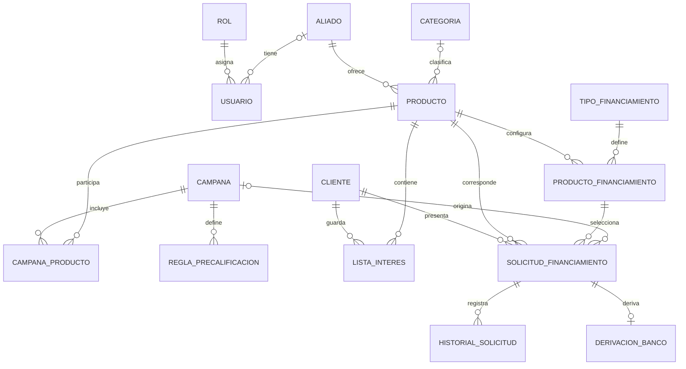

# Requerimientos técnicos y modelo de datos

## Tabla de contenido

- [1. Arquitectura y tecnología](#1-arquitectura-y-tecnología)
- [2. Convenciones de persistencia](#2-convenciones-de-persistencia)
- [3. Entidades](#3-entidades)
  - [Seguridad y usuarios](#seguridad-y-usuarios)
  - [Actores y catálogo](#actores-y-catálogo)
  - [Campañas y financiamiento](#campañas-y-financiamiento)
- [4. Relaciones del modelo](#4-relaciones-del-modelo)
- [5. Definición lógica de tablas](#5-definición-lógica-de-tablas)
  - [`rol`](#rol)
  - [`usuario`](#usuario)
  - [`aliado` y `cliente`](#aliado-y-cliente)
  - [`categoria` y `producto`](#categoria-y-producto)
  - [`tipo_financiamiento` y `producto_financiamiento`](#tipo_financiamiento-y-producto_financiamiento)
  - [`campana`, `campana_producto` y `regla_precalificacion`](#campana-campana_producto-y-regla_precalificacion)
  - [`lista_interes`](#lista_interes)
  - [`solicitud_financiamiento`](#solicitud_financiamiento)
  - [`historial_solicitud`](#historial_solicitud)
  - [`derivacion_banco`](#derivacion_banco)
- [6. Catálogos y estados](#6-catálogos-y-estados)
- [7. Integridad, seguridad y rendimiento](#7-integridad-seguridad-y-rendimiento)
- [8. Flujo técnico de una solicitud](#8-flujo-técnico-de-una-solicitud)
- [9. Consultas técnicas de negocio](#9-consultas-técnicas-de-negocio)
  - [Productos y modalidades disponibles](#productos-y-modalidades-disponibles)
  - [Solicitudes precalificadas sin derivación bancaria](#solicitudes-precalificadas-sin-derivación-bancaria)
  - [Productos sin financiamiento vigente](#productos-sin-financiamiento-vigente)
  - [Resumen por modalidad de financiamiento](#resumen-por-modalidad-de-financiamiento)
- [10. Decisiones técnicas](#10-decisiones-técnicas)

## 1. Arquitectura y tecnología

- Base de datos relacional PostgreSQL 15 o superior.
- Backend responsable de autenticación, autorización, precalificación, tasas, estados y derivación bancaria.
- Integración con el banco mediante un servicio externo.
- Modelo normalizado en tercera forma normal (3FN).
- Identificadores numéricos con `INTEGER GENERATED BY DEFAULT AS IDENTITY`.
- Fechas y horas con `timestamptz` y zona horaria `America/Lima`.
- Formato de intercambio de fecha y hora: `YYYY-MM-DD HH:MM:SS`.
- Moneda predeterminada: `PEN`.

## 2. Convenciones de persistencia

Todas las tablas deben incluir:

```sql
alta SMALLINT NOT NULL DEFAULT 1 CHECK (alta IN (0, 1))
```

`alta = 1` representa un registro activo y `alta = 0` un registro inactivo. No se ejecuta `DELETE`; el borrado lógico se realiza mediante `UPDATE`.

Las relaciones utilizan `ON DELETE RESTRICT`. Las columnas monetarias usan `NUMERIC` o `DECIMAL`, nunca `FLOAT`. Los correos pueden manejarse con `citext` para garantizar unicidad sin distinguir mayúsculas y minúsculas.

## 3. Entidades

### Seguridad y usuarios

- `rol`: roles `administrador` y `aliado`; `nombre_rol` es único.
- `usuario`: credenciales, rol, aliado asociado opcional, correo único, hash de contraseña, estado de actividad y fechas de acceso.

Reglas:

- Un usuario aliado debe tener `aliado_id`.
- Un usuario administrador no debe tener `aliado_id`.
- Nunca se almacena la contraseña en texto plano.

### Actores y catálogo

- `aliado`: RUC, razón social y datos de contacto.
- `cliente`: tipo de persona, documento, nombres y apellidos o razón social, correo y teléfono.
- `categoria`: clasificación de productos.
- `producto`: producto comercial perteneciente a un aliado, con categoría, precio, moneda, IGV, imagen y estado.
- `tipo_financiamiento`: modalidades `VEHICULAR` y `CAPITAL_TRABAJO`.
- `producto_financiamiento`: tasa, tipo de tasa, montos, plazos y vigencia de una modalidad para un producto.

### Campañas y financiamiento

- `campana`: nombre, descripción, fechas, estado y usuario creador.
- `campana_producto`: relación entre campañas y productos, con beneficio y condiciones comerciales.
- `regla_precalificacion`: condiciones de edad, ingresos, monto y plazo asociadas a una campaña.
- `lista_interes`: productos guardados por un cliente.
- `solicitud_financiamiento`: cliente, producto, modalidad, campaña opcional, monto, plazo, tasa aplicada, resultado, estado y consentimiento.
- `historial_solicitud`: evolución de estados, observaciones y usuario que realizó el cambio.
- `derivacion_banco`: solicitud enviada, código externo, estado de respuesta y detalle de la respuesta.

## 4. Relaciones del modelo



## 5. Definición lógica de tablas

### `rol`

| Campo        | Tipo             | Restricción                         |
| ------------ | ---------------- | ----------------------------------- |
| `id`         | integer identity | PK                                  |
| `nombre_rol` | varchar(30)      | NOT NULL, UNIQUE                    |
| `alta`       | smallint         | NOT NULL, valores 0 o 1             |
| `creado_at`  | timestamptz      | NOT NULL, valor por defecto `now()` |

### `usuario`

| Campo                                 | Tipo             | Restricción                  |
| ------------------------------------- | ---------------- | ---------------------------- |
| `id`                                  | integer identity | PK                           |
| `rol_id`                              | integer          | FK a `rol`                   |
| `aliado_id`                           | integer          | FK opcional a `aliado`       |
| `correo_electronico`                  | citext           | NOT NULL, UNIQUE             |
| `password_hash`                       | text             | NOT NULL                     |
| `activo`                              | boolean          | NOT NULL, por defecto `true` |
| `ultimo_acceso_at`                    | timestamptz      | Opcional                     |
| `alta`, `creado_at`, `actualizado_at` | -                | Auditoría y borrado lógico   |

### `aliado` y `cliente`

`aliado` debe almacenar `razon_social`, `tipo_documento`, `numero_documento`, `contacto_nombre`, `contacto_correo`, `contacto_telefono`, `estado` y fechas de auditoría. El documento del aliado es un RUC de 11 dígitos y es único.

`cliente` debe almacenar `tipo_persona`, `tipo_documento`, `numero_documento`, datos personales o empresariales, correo, teléfono y fechas de auditoría. La combinación `tipo_documento + numero_documento` es única.

Reglas de validación del cliente:

- Persona natural: `DNI`, `CE` o `PASAPORTE`, con nombres y apellidos.
- Persona jurídica: `RUC`, con 11 dígitos y razón social.
- Una persona natural no debe tener razón social.
- Una persona jurídica no debe tener nombres ni apellidos.

### `categoria` y `producto`

`categoria` contiene `id`, `nombre`, `descripcion`, `activo` y `alta`.

`producto` contiene `id`, `aliado_id`, `categoria_id`, `nombre`, `descripcion`, `precio_lista`, `moneda`, `incluye_igv`, `imagen_url`, `estado`, `alta`, `creado_at` y `actualizado_at`.

El producto pertenece obligatoriamente a un aliado. La moneda predeterminada es `PEN` y el precio no puede ser negativo.

### `tipo_financiamiento` y `producto_financiamiento`

`tipo_financiamiento` contiene `codigo`, `nombre`, `descripcion`, `activo` y `alta`. Los valores iniciales son:

```sql
INSERT INTO tipo_financiamiento (codigo, nombre, descripcion)
VALUES
    ('VEHICULAR', 'Financiamiento vehicular', 'Financiamiento para adquisición de vehículos'),
    ('CAPITAL_TRABAJO', 'Capital de trabajo', 'Financiamiento para operaciones de negocio');
```

`producto_financiamiento` contiene:

- `producto_id` y `tipo_financiamiento_id` como claves foráneas.
- `tipo_tasa` con valores `TEA` o `TNA`.
- `tasa_anual` entre 0 y 100.
- `plazo_minimo_meses` y `plazo_maximo_meses` positivos.
- `monto_minimo` y `monto_maximo` no negativos.
- `vigente_desde` y `vigente_hasta`.
- `activo` y `alta`.

El plazo máximo no puede ser menor que el mínimo y la fecha final no puede ser anterior a la fecha inicial.

### `campana`, `campana_producto` y `regla_precalificacion`

- `campana` contiene `nombre`, `descripcion`, `fecha_inicio`, `fecha_fin`, `estado`, `creado_por_id`, `alta` y fechas de auditoría.
- `campana_producto` tiene PK compuesta por `campana_id` y `producto_id`, además de `beneficio`, `condiciones_comerciales` y `alta`.
- `regla_precalificacion` contiene `campana_id`, edades, ingreso mínimo, montos, plazos, `activo` y `alta`.

Las fechas de campaña deben ser válidas y las reglas deben impedir rangos invertidos.

### `lista_interes`

Contiene `id`, `cliente_id`, `producto_id`, `creado_at` y `alta`. Debe existir una restricción `UNIQUE (cliente_id, producto_id)`.

### `solicitud_financiamiento`

Contiene:

- `cliente_id`, `producto_id` y `producto_financiamiento_id`.
- `campana_id` opcional.
- `monto_solicitado`, `moneda` y `plazo_meses`.
- `tasa_tipo_aplicada` y `tasa_anual_aplicada`.
- `resultado_precalificacion`.
- `estado`.
- `consentimiento_at`.
- `alta`, `creado_at` y `actualizado_at`.

La tasa aplicada se copia desde la configuración vigente para conservar las condiciones históricas. La combinación de `producto_financiamiento_id` y `producto_id` debe validarse mediante una clave foránea compuesta.

### `historial_solicitud`

Contiene `solicitud_id`, `estado_anterior`, `estado_nuevo`, `observacion`, `usuario_id`, `creado_at` y `alta`. Permite reconstruir cronológicamente la evolución de cada solicitud.

### `derivacion_banco`

Contiene `solicitud_id` único, `codigo_externo` único opcional, `derivado_at`, `estado_respuesta_banco`, `ultima_respuesta_at`, `respuesta_detalle` y `alta`.

Una solicitud puede tener como máximo una derivación bancaria.

## 6. Catálogos y estados

```sql
CREATE TYPE tipo_documento AS ENUM ('DNI', 'CE', 'PASAPORTE', 'RUC');
CREATE TYPE tipo_persona AS ENUM ('NATURAL', 'JURIDICA');
CREATE TYPE tipo_tasa_interes AS ENUM ('TEA', 'TNA');
CREATE TYPE resultado_precalificacion AS ENUM ('pendiente', 'precalificado', 'no_precalificado');
CREATE TYPE estado_solicitud AS ENUM (
    'precalificado', 'no_precalificado', 'derivado', 'en_evaluacion',
    'aprobado', 'rechazado', 'cerrado', 'cancelado'
);
```

Los estados deben mantenerse controlados mediante catálogos o enumeraciones. No se debe guardar estado o resultado de precalificación como texto libre.

## 7. Integridad, seguridad y rendimiento

- Crear índices para claves foráneas y consultas frecuentes.
- Incluir índices para solicitudes por cliente, estado y fecha de creación.
- Crear índices para productos por aliado y estado.
- Crear índices para campañas por fecha de vigencia.
- Aplicar `NOT NULL` a los datos obligatorios.
- Aplicar `CHECK` a montos, tasas, plazos, documentos y fechas.
- Usar `ON DELETE RESTRICT` en todas las relaciones.
- Aplicar autorización en backend y filtrar los datos del aliado por su propio `aliado_id`.
- Proteger datos personales y cifrar la comunicación con el banco.
- Registrar el consentimiento conforme a la Ley N.° 29733 y su reglamento.
- Crear una transacción para registrar la solicitud, su primer estado y la derivación cuando corresponda.
- Usar `SET TIME ZONE 'America/Lima'` en la configuración de la base de datos.
- Habilitar `citext` cuando se requiera unicidad de correos sin distinción de mayúsculas.

## 8. Flujo técnico de una solicitud

1. El backend valida que el usuario tenga permisos y que el producto pertenezca a su aliado cuando corresponda.
2. Se valida el cliente, el producto, la modalidad, el monto y el plazo.
3. Se obtiene la configuración vigente de `producto_financiamiento`.
4. Se ejecutan las reglas de precalificación.
5. Se registra la solicitud con la tasa aplicada y el consentimiento.
6. Se registra el primer estado en `historial_solicitud`.
7. Si la solicitud está precalificada y autorizada, se crea `derivacion_banco`.
8. Se persiste la respuesta del banco y se actualiza el historial.

## 9. Consultas técnicas de negocio

### Productos y modalidades disponibles

```sql
SELECT a.razon_social AS aliado,
             p.nombre AS producto,
             tf.nombre AS tipo_financiamiento,
             pf.tipo_tasa,
             pf.tasa_anual
FROM aliado a
INNER JOIN producto p ON p.aliado_id = a.id
INNER JOIN producto_financiamiento pf ON pf.producto_id = p.id
INNER JOIN tipo_financiamiento tf ON tf.id = pf.tipo_financiamiento_id
WHERE a.alta = 1 AND p.alta = 1 AND pf.alta = 1 AND tf.alta = 1
ORDER BY a.razon_social, p.nombre
LIMIT 20;
```

### Solicitudes precalificadas sin derivación bancaria

```sql
SELECT s.id,
             c.numero_documento,
             p.nombre AS producto,
             s.monto_solicitado,
             s.plazo_meses,
             s.creado_at
FROM solicitud_financiamiento s
INNER JOIN cliente c ON c.id = s.cliente_id
INNER JOIN producto p ON p.id = s.producto_id
LEFT JOIN derivacion_banco db ON db.solicitud_id = s.id
WHERE s.alta = 1
    AND c.alta = 1
    AND p.alta = 1
    AND s.estado = 'precalificado'
    AND db.id IS NULL
ORDER BY s.creado_at DESC
LIMIT 20;
```

### Productos sin financiamiento vigente

```sql
SELECT p.id, p.nombre, a.razon_social AS aliado
FROM producto p
INNER JOIN aliado a ON a.id = p.aliado_id
LEFT JOIN producto_financiamiento pf
        ON pf.producto_id = p.id AND pf.alta = 1
WHERE p.alta = 1 AND a.alta = 1 AND pf.id IS NULL
ORDER BY a.razon_social, p.nombre;
```

### Resumen por modalidad de financiamiento

```sql
SELECT tf.nombre AS tipo_financiamiento,
             COUNT(s.id) AS cantidad_solicitudes,
             SUM(s.monto_solicitado) AS monto_total_solicitado,
             AVG(s.monto_solicitado) AS monto_promedio
FROM solicitud_financiamiento s
INNER JOIN producto_financiamiento pf ON pf.id = s.producto_financiamiento_id
INNER JOIN tipo_financiamiento tf ON tf.id = pf.tipo_financiamiento_id
WHERE s.alta = 1 AND pf.alta = 1 AND tf.alta = 1
GROUP BY tf.id, tf.nombre
ORDER BY monto_total_solicitado DESC;

```

## 10. Decisiones técnicas

1. `producto_financiamiento` permite configurar distintas tasas, montos, plazos y vigencias por producto y modalidad.
2. `alta` permite conservar trazabilidad mediante borrado lógico.
3. Las reglas de negocio se ejecutan en el backend y la integridad estructural en PostgreSQL.
4. La tasa aplicada se almacena en la solicitud para conservar las condiciones históricas.

## 10.Estructura para explicar en la presentación:

config: seguridad, JWT, CORS y manejo de errores.
controller: endpoints REST y DTOs de entrada.
domain: servicios y modelos de negocio.
repository: entidades JPA, repositorios y persistencia.
RequestMapper: convierte requests HTTP a modelos de dominio.
PersistenceMapper: convierte entidades JPA a modelos de dominio y viceversa.
db/migration: creación versionada del esquema PostgreSQL con Flyway.
